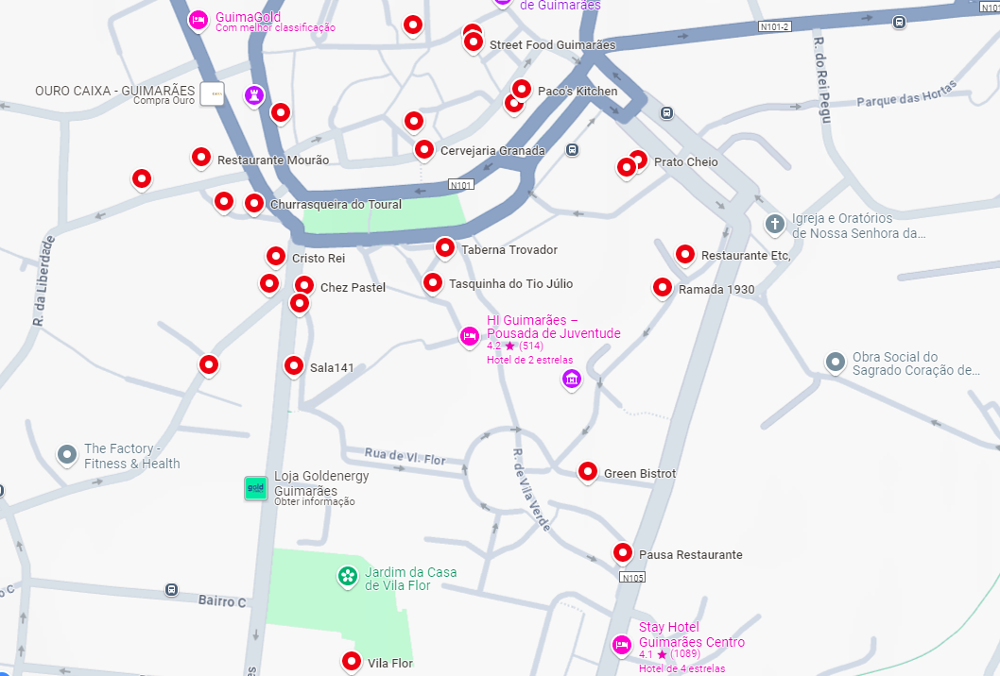

# General Information

Here you can find some useful information on the conference location the host city of [Guimarães](https://www.visitguimaraes.travel/inicio#).

## Venue 

The conference will take place at [Fraterna](https://www.fraterna.org/), located in the heart of the city of Guimarães. You can find below a map pinpointing the location of the venue.

<iframe src="https://www.google.com/maps/embed?pb=!1m18!1m12!1m3!1d503.56742358285464!2d-8.293301414995154!3d41.439106257514055!2m3!1f0!2f0!3f0!3m2!1i1024!2i768!4f13.1!3m3!1m2!1s0xd24efc45faa6439%3A0x588b0f7873ad0517!2sFraterna-%20Centro%20Comunit%C3%A1rio%20de%20Solidariedade%20e%20Integra%C3%A7%C3%A3o%20Social!5e1!3m2!1sen!2spt!4v1712607980540!5m2!1sen!2spt" width="95%" height="450" style="border:0;" allowfullscreen="" loading="lazy" referrerpolicy="no-referrer-when-downgrade"></iframe>

 
 

## Conference Dinner

The Conference dinner will take place on Thursday night, **September 12th, at 20h**{: style="color: #00b050; opacity: 1.00;" } at the restaurant [Casa Amarela](https://casaamarela.pt/) - R. de Donães 24, 4800-408 Guimarães.  You can find below a map pinpointing the location of the restaurant.

<iframe src="https://www.google.com/maps/embed?pb=!1m18!1m12!1m3!1d198.24075255682692!2d-8.290741182097694!3d41.442075716062135!2m3!1f270!2f39.41122307354855!3f0!3m2!1i1024!2i768!4f35!3m3!1m2!1s0xd24efe9f0723ecf%3A0x59ac974e1ff0e80f!2sCASA%20AMARELA!5e1!3m2!1sen!2spt!4v1726011826207!5m2!1sen!2spt" width="95%" height="450" style="border:0;" allowfullscreen="" loading="lazy" referrerpolicy="no-referrer-when-downgrade"></iframe>

 
 

## Restaurants around the Venue

You can find below a non-complete list of restaurants around the conference venue where you can have lunch. Click this [link](https://maps.app.goo.gl/JJcns1ZR7DjMH9JcA) to see the list on Google maps. 

- **Tasquinha do Tio Júlio**: R. de Couros (2min)
- **Pregaria Guimarães**: Av. Dom Afonso Henriques (5 min)
- **Restaurante Etc**: R. da Ramada (4min)
- **Le Babachris**: Largo Condessa do Juncal (6min)
- **Taberna Trovador**: Largo do Trovador (3 min)
- **Cervejaria Granada**: R. Mte. Caçoila (6 min)
- **Street Food Guimarães**: R. de Donães (8 min)
- **Prato Cheio**: R. Padre Gaspar Roriz (7 min)
- **Churrasqueira do Toural**: Tv. de Camões (5 min)
- **Universo das Sandes**: Alameda de São Dâmaso (7min)
- **Green Bistrot**: R. Camilo Castelo Branco (2 min)
- **Restaurante Mourão**: R. de Camões (6 min)
- **Porta Larga**: R. da Caldeirôa (7 min)
- **Pausa Restaurante**: Av. Dom João IV (5 min)
- **Taberna do Camões**: Tv. de Camões (6 min)
- **Ramada 1930**: R. da Ramada (4 min)
- **Sala 141**: Av. Dom Afonso Henriques (4 min)
- **Cervejaria Martins Sports Bar**: Largo do Toural (6 min)
- **Sonetos**: R. de Camões (6 min)
- **Paco’s Kitchen**: Alameda de São Dâmaso (7 min)
- **Recanto Snack Bar**: R. da Caldeirôa (6 min)
- **Chez Pastel**: R. de Vila Flor (5 min)
- **Cristo Rei**: Largo Bernardo Valentim (5 min)
- **Vila Flor**: Av. Dom Afonso Henriques (8 min)
- **Soul Street Burger**: Alameda de São Dâmaso (7 min)
- **Recanto 93**: R. Rainha Dona Maria II (8 min)
- **Marco Bellini è que sabe!**: R. de Donães (8 min)

 

  

 
 

## How to get here 

#### By train 

There is a suburban train service between Porto and Guimarães. The service runs usually on a hourly basis and takes between 1h and 1h20 minutes depending on the train. For more information on the schedule, consult the [CP website](https://www.cp.pt/StaticFiles/horarios/urbanos-porto/comboios-urbanos-porto-guimaraes.pdf).

#### By Bus 

There are regular bus services from all regions of Portugal to the central bus station in Guimarães.

<iframe src="https://www.google.com/maps/embed?pb=!1m18!1m12!1m3!1d1213.4399751066853!2d-8.304421329909339!3d41.44099268760594!2m3!1f0!2f0!3f0!3m2!1i1024!2i768!4f13.1!3m3!1m2!1s0xd24efe75512b9e1%3A0xca0112af53fab857!2zRXN0YcOnw6NvIFJvZG92acOhcmlhIGRlIEd1aW1hcsOjZXM!5e1!3m2!1sen!2spt!4v1712609000552!5m2!1sen!2spt" width="95%" height="450" style="border:0;" allowfullscreen="" loading="lazy" referrerpolicy="no-referrer-when-downgrade"></iframe>
