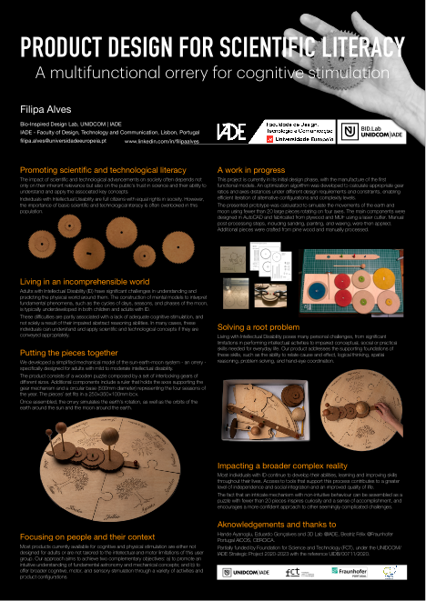
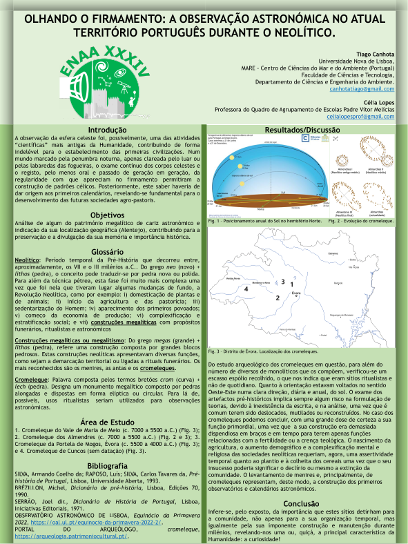
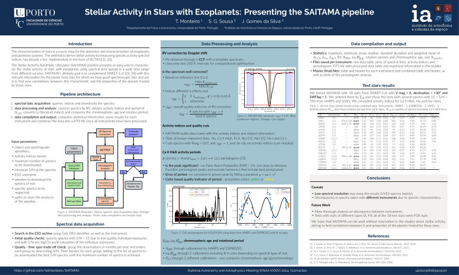
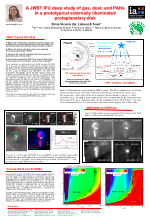

<html lang="en">
<head>
    
    
</head>

<body>
    

        <label for="passwordBox">Enter Password:</label>
        <input type="password" id="passwordBox">
        <button onclick="checkPassword()">Submit</button>
    

<h1 id="poster-gallery">Poster Gallery</h1>

You can find a gallery of the posters for this conference below. Click on the image to open the poster. Click on the poster title to see the corresponding abstract.

    

    <a target="_blank" href="assets/posters/poster-id-2.pdf">
        Product Design for Scientific Literacy: development of a multifunctional orrery for cognitive stimulation</i> by F. Alves">
    </a>
    
F. Alves

    

     <a href=https://enaa-xxxiv.github.io/abstract_book#abs-2> 
        Product Design for Scientific Literacy: development of a multifunctional orrery for cognitive stimulation
     </a>
    

    

    

    <a target="_blank" href="assets/posters/poster-id-12.pdf">
        OLHANDO O FIRMAMENTO: A OBSERVAÇÃO ASTRONÓMICA NO ATUAL TERRITÓRIO PORTUGUÊS DURANTE O NEOLÍTICO</i> by T. Canhota">
    </a>
    
T. Canhota

    

     <a href=https://enaa-xxxiv.github.io/abstract_book#abs-12> 
        OLHANDO O FIRMAMENTO: A OBSERVAÇÃO ASTRONÓMICA NO ATUAL TERRITÓRIO PORTUGUÊS DURANTE O NEOLÍTICO
     </a>
    

    

    

    <a target="_blank" href="assets/posters/poster-id-45.pdf">
        The stellar activity in stars with exoplanets</i> by T. Monteiro">
    </a>
    
T. Monteiro

    

     <a href=https://enaa-xxxiv.github.io/abstract_book#abs-45> 
        The stellar activity in stars with exoplanets
     </a>
    

    

    

    <a target="_blank" href="assets/posters/poster-id-66.pdf">
        "A JWST IFU deep study of gas, dust, and PAHs in a prototypical externally illuminated protoplanetary disk"</i> by S. Vicente">
    </a>
    
S. Vicente

    

     <a href=https://enaa-xxxiv.github.io/abstract_book#abs-66> 
        "A JWST IFU deep study of gas, dust, and PAHs in a prototypical externally illuminated protoplanetary disk"
     </a>
    

    

    

    
</body>

</html>

